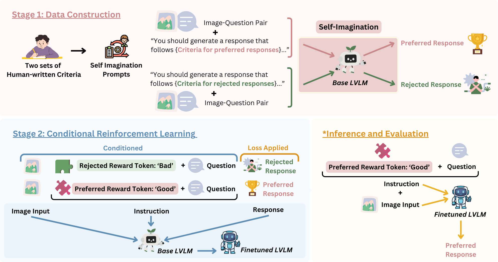

# MACAROON: Training Vision-Language Models To Be Your Engaged Partners


## 🎀Overview
We present self-iMaginAtion for ContrAstive pReference OptimizatiON, MACAROON, which leverages self-imagination based on human criteria to construct the contrastive preference dataset and utilizes conditional reinforcement learning for unified training. MACAROON can effectively enhance the proactive conversation capabilities of LVLMs, showcasing the potential for LVLMs to evolve into truly interactive partners that enhance rather than impede effective communication.


## 🌟Requirements
The required Python packages for running this repo are listed in [requirements.txt](./requirements.txt). To install these pacakages at one time, plaese run
```shell
pip install -r requirements.txt
```

For evaluation, you may need to set up variable `openai.api_key` in line 10 in [metric_cal.py](./eval/metric_cal.py)

## 📊Datasets
Both the evaluation dataset of 🍰PIE and those training datasets are stored [here](https://drive.google.com/drive/folders/1MSxrwENeTALKmhvthbCx15BvgHM9sTDW?usp=drive_link). You can simply download it and place it under the MACAROON folder for further training & evaluation.

> [!NOTE]  
> The evaluation dataset of PIE are under `eval`, named `evaluation_dataset.jsonl`.\
> The training datasets are under `train` and there are multiple files used for different tuning methods. Specifically: \
> `preference_dataset.json` and `VLfeedback_dataset.json` are used for standard supervised fine-tuning(SFT) and DPO.\
> `preference_dataset_seperate.json` and `VLfeedback_dataset_seperate.json` are used for MACAROON's conditional reinforcement learning(CRL).\
> `preference_dataset_multiturn.json` and `vlfeedback_nlf_conversations.jsonl` are used for training on multiturn conversational data.

## 🚀Training
The training for MACAROON uses [train_SFT.py](./train/train_SFT.py). Note that our ablation studies on SFT and multi-turn conversational training also uses this file. So you will need to specify the methods used for training in argument of command-line for running. For instance, training MACAROON using CRL should run
```shell
python -m torch.distributed.launch --nproc_per_node=1 --nnodes=1 --node_rank=0 --master_addr="192.168.0.1" --master_port=1234 train_SFT.py --method CRL 
```
Except for MACAROON, SFT and multi-turn conversation training, the training for DPO uses [train_dpo.py](./train/train_dpo.py). You don't need to specify the method to run it. Just simply run 
```shell
python -m torch.distributed.launch --nproc_per_node=1 --nnodes=1 --node_rank=0 --master_addr="192.168.0.1" --master_port=1234 train_dpo.py
```
> [!NOTE]  
> We uses distributed training for efficiency, you can always change parameters such as `nproc_per_node` based on your own situations. 

## 🛠️Evaluation
The evaluation results for MACAROON and other ablation studies in Table 1 are generated through two steps:
1. Generate model's responses with [evaluate.py](./eval/evaluate.py). Note that you still need to specify the methods(for training the model) you want to evaluate in argument of command-line. For instance, to evaluate MACAROON, which is trained using Conditional Reinforcement Learning, run
```shell
python eval/evaluate.py --method CRL
```
2. After the responses are generated, evaluate them with [metric_cal.py](./eval/metric_cal.py). For CRL, run
```shell
python eval/metric_cal.py --method CRL
```

## 📚Citation
If you use or extend our work, please consider citing our paper. Thank you for your support! 🥰
